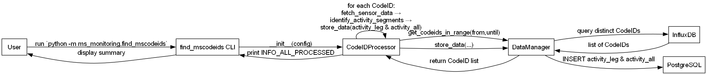
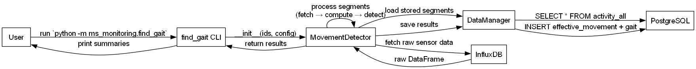

[](https://github.com/MultipleSclerosisMonitoring/DPC_2024/actions)
[](LICENSE)

# MS Monitoring

Modular Python utilities for monitoring wearable devices  
in multiple sclerosis studies.

---  
## Table of Contents

1. [High-Level Workflow](#high-level-workflow)  
2. [Quickstart](#quickstart)  
3. [Installation](#installation)  
4. [Configuration](#configuration)  
5. [Documentation](#documentation)  
6. [Contributing](#contributing)  
7. [License](#license)

---

## High-Level Workflow

### 1. find_mscodeids

Extracts unique device CodeIDs, identifies activity segments,  
and persists them to PostgreSQL.



### 2. find_gait

Processes stored activity segments, applies power/time-based checks  
to detect effective movements and gait episodes.



## Directory Structure

```
.
├── config.yaml           # Template for InfluxDB & PostgreSQL
├── requirements.txt
├── docs/                 # Sphinx documentation
├── static/               # CLI workflow diagrams
├── msTools/              # Shared utilities package
├── msCodeID/             # CodeID processing package
├── msGait/               # Gait signal processing package
├── ms_monitoring/        # CLI entry-point scripts
└── README.md             # This file
```

## Installation

### With Poetry

```bash
curl -sSL https://install.python-poetry.org | python3 -
git clone https://github.com/MultipleSclerosisMonitoring/DPC_2024.git
cd DPC_2024
poetry install
poetry shell
```

### With pip

```bash
python -m venv venv
source venv/bin/activate          # On Windows: venv\Scripts\activate
pip install -r requirements.txt
```

## Configuration

Copy or edit `config.yaml` in the project root:

```yaml
influxdb:
  url:         "https://<HOST>:8086"
  token:       "<YOUR_TOKEN>"
  org:         "<ORG>"
  bucket:      "<BUCKET>"
  measurement: "<MEASUREMENT>"
  verify:      false
  timeout:     900000

postgresql:
  host:     "<PG_HOST>"
  port:     5432
  user:     "<USER>"
  password: "<PASSWORD>"
  database: "<DB_NAME>"

movement:
  accel_threshold:      0.2
  gyro_threshold:       0.2
  power_threshold:      0.5
  freq_band_min:        0.4
  freq_band_max:        1.4
  min_continuous_seconds: 10
```

## Documentation

Full Sphinx docs are in `docs/`. To rebuild locally:

```bash
cd docs
make html
```

Open `_build/html/index.html` in your browser.

## Contributing

1. Fork the repo  
2. Create a branch: `git checkout -b feature/your-feature`  
3. Make your changes & tests  
4. Open a Pull Request

## License

This project is licensed under the **MIT License**. See [LICENSE](LICENSE) for details.
