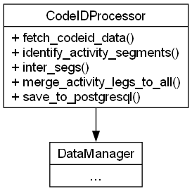

# msCodeID

Python module for processing wearable device CodeIDs.

## Architecture Overview



*Class Diagram: `CodeIDProcessor` and its connection to `DataManager`*

The **msCodeID** package centers on the `CodeIDProcessor` class, which orchestrates fetching raw sensor data, identifying activity segments, and preparing them for database storage.

## Core Components

- **CodeIDProcessor** (`codeid_processor.py`)
  - `__init__(data_manager: DataManager)`
  - `fetch_codeid_data(codeid: str, start_datetime: str, end_datetime: str) -> pandas.DataFrame`
  - `identify_activity_segments(df: pandas.DataFrame, threshold_seconds: float, foot: str) -> pandas.DataFrame`
  - `inter_segs(sg1: pandas.DataFrame, sg2: pandas.DataFrame) -> pandas.DataFrame`
  - `merge_activity_legs_to_all(act_segR: pandas.DataFrame, act_segL: pandas.DataFrame, inter: pandas.DataFrame) -> pandas.DataFrame`
  - `save_to_postgresql(table_name: str, df: pandas.DataFrame) -> None`

- **Pydantic Models** (`msGait.models`):
  - `ActivitySegment`

## Requirements

- Python 3.12 or higher
- Dependencies (installed via project):
  - `influxdb-client>=1.35.0`
  - `pandas>=2.0.0`
  - `pydantic>=1.10.0`
  - `PyYAML>=6.0`

## Configuration

Reads InfluxDB settings from `config.yaml`:

```yaml
influxdb:
  org: 'UPM'
  bucket: 'Gait/autogen'
  measurement: 'Gait'
  url: "https://<HOST>:8086"
  token: "<YOUR_TOKEN>"
  verify: false
  timeout: 900000
```

## Usage in Python

```python
from msTools.data_manager import DataManager
from msCodeID.codeid_processor import CodeIDProcessor

dm = DataManager(config_path="config.yaml")
processor = CodeIDProcessor(dm)

df = processor.fetch_codeid_data(
    codeid="DEVICE123",
    start_datetime="2024-01-01 00:00:00",
    end_datetime="2024-01-02 00:00:00"
)
print(df.head())
```

## CLI Integration

While **msCodeID** does not expose its own CLI, it is used within the `find_mscodeids` script:

```bash
python -m ms_monitoring.find_mscodeids -c config.yaml -f "2024-01-01 00:00:00" -u "2024-01-02 00:00:00" -v 1
```

## File Structure

- `codeid_processor.py`: Main processing class.
- `__init__.py`

## Contributing

Contributions are welcome:

1. Fork the repository.
2. Create a branch: `git checkout -b feature/your-feature`.
3. Make changes and open a pull request.

## License

MIT License. See the root `LICENSE` file for details.
