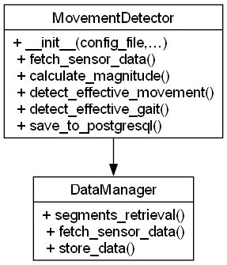

# msGait

Gait signal processing, classification, and analysis for MS Monitoring.

## Architecture Overview



*Class Diagram: `MovementDetector` and its connection to `DataManager`*

## Core Components

- **MovementDetector** (`movement_detector.py`)  
  - `__init__(data_manager: DataManager, sampling_rate: float, sect: str, verbose: int)`  
  - `fetch_sensor_data(start: str, end: str, codeid_id: int, foot: str) -> pandas.DataFrame`  
  - `calculate_magnitude(df: pandas.DataFrame) -> pandas.Series`  
  - `detect_effective_movement(activity_windows: pandas.DataFrame, nomf: Optional[str], vb: int) -> pandas.DataFrame`  
  - `detect_effective_gait(df_effective: pandas.DataFrame, vb: int) -> pandas.DataFrame`  
  - `save_to_postgresql(table_name: str, df: pandas.DataFrame, verbose: int) -> None`

- **(Future)**  
  - **GaitClassifier** (`gait_classifier.py`)  
  - **TrajectoryAnalyzer** (`trajectory_analyzer.py`)

## Requirements

- Python 3.12 or higher  
- The ms_monitoring package dependencies (installed via `requirements.txt`):  
  `influxdb-client`, `pandas`, `pydantic`, `PyYAML`, etc.

## Configuration

Add a `movement` section to your `config.yaml`:

```yaml
movement:
  # Threshold for the acceleration module (is_effective_by_time)
  accel_threshold: 0.2
  # Threshold for the gyroscope module (is_effective_by_time)
  gyro_threshold: 60
  # Power threshold in the Accel frequency band
  accel_power_threshold: 0.125
  # Power threshold in the Gyro frequency band
  gyro_power_threshold: 1000
  # Frequency band for Welch (Hz)
  freq_band_min: 0.4
  freq_band_max: 1.6
  # Minimum number of peaks within an analysis segment ~ 7s
  min_continuous_hits: 3
```

## Python Usage

```python
from msTools.data_manager import DataManager
from msGait.movement_detector import MovementDetector

# 1. Initialize DataManager
dm = DataManager(config_path="config.yaml")

# 2. Retrieve stored activity windows
df_windows = dm.segments_retrieval(
    fstart="2024-01-01 00:00:00",
    fend="2024-01-02 00:00:00",
    ids=None,
    verbose=1
)

# 3. Initialize MovementDetector
detector = MovementDetector(
    data_manager=dm,
    sampling_rate=50,     # Hz
    sect="movement",
    verbose=1
)

# 4. Detect effective movements
df_effective = detector.detect_effective_movement(
    activity_windows=df_windows,
    nomf="raw_output.xlsx",  # optional Excel export
    vb=2                      # detail level
)

# 5. Detect gait episodes
df_gait = detector.detect_effective_gait(df_effective, vb=1)

# 6. Save to PostgreSQL
detector.save_to_postgresql("effective_movement", df_effective, verbose=1)
detector.save_to_postgresql("effective_gait", df_gait, verbose=1)
```

## Command-Line Usage

You can also run the full CLI:

```bash
python -m ms_monitoring.find_gait   -c config.yaml   -i "[ID1,ID2,...]"   -l en   --output raw_output.xlsx   --head-rows 5   --save   -v 2
```

**Options**  
- `-c, --config` (YAML path; required)  
- `-i, --ids` JSON list of `activity_all` IDs (required)  
- `-l, --lang` Interface language (`en`/`es`, default `en`)  
- `--output` Export raw sensor data to XLSX  
- `--head-rows` Rows to preview when `-v ≥ 2` (default 5)  
- `--save` Persist both `effective_movement` and `effective_gait`  
- `-v, --verbose` Verbosity level (0–2)

## Documentation

Full Sphinx-generated docs live in [`docs/msGait.rst`](../docs/msGait.rst). To rebuild:

```bash
cd docs
make html
```

## Contributing

1. Fork the repo  
2. Create a branch: `git checkout -b feature/your-feature`  
3. Commit and PR  

## License

MIT. See [LICENSE](../LICENSE).  
