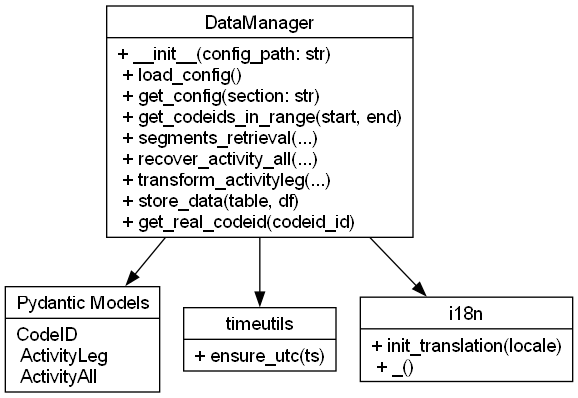

# msTools

Shared utility module for MS Monitoring: YAML configuration management, InfluxDB/PostgreSQL interaction, data models, internationalization, and time utilities.

## Architecture Overview



*Class Diagram: `DataManager` and its connections to Pydantic models, `timeutils`, and `i18n`.*

## Core Components

- **DataManager** (`data_manager.py`)  
  - `__init__(config_path: str)`  
  - `load_config(config_path: str) -> Dict`  
  - `get_config(section: str) -> Dict`  
  - `get_codeids_in_range(start_datetime: str, end_datetime: str) -> List[str]`  
  - `segments_retrieval(fstart: Optional[str], fend: Optional[str], ids: Optional[List[int]], verbose: int) -> pd.DataFrame`  
  - `recover_activity_all(act: pd.DataFrame, vb: int) -> pd.DataFrame`  
  - `transform_activityleg(data: pd.DataFrame) -> pd.DataFrame`  
  - `store_data(table_name: str, data: pd.DataFrame, verbose: int) -> List[int]`  
  - `get_real_codeid(codeid_id: int) -> str`  
  - Manages InfluxDB and PostgreSQL connections and closing logic.

- **Pydantic Models** (`models.py`)  
  - `CodeID`  
  - `ActivityLeg`  
  - `ActivityAll`

- **Time Utilities** (`timeutils.py`)  
  - `ensure_utc(ts: str | datetime) -> pd.Timestamp`

- **Internationalization** (`i18n.py`)  
  - `init_translation(locale: str) -> None`  
  - `_()` helper for translated messages

## Installation

This module is included in the main **ms_monitoring** package. After cloning or installing via `pip` or `poetry`:

```bash
# Using Poetry
poetry install

# Or with pip
pip install ms_monitoring
```

## Usage

### 1. DataManager

```python
from msTools.data_manager import DataManager

# Initialize with your YAML configuration
dm = DataManager(config_path='config.yaml')

# Create/verify tables in PostgreSQL
dm.check_and_create_tables('msTools/create_tables.sql')

# Execute a SQL query and get a DataFrame
df = dm.fetch_data('SELECT * FROM codeids;')
print(df.head())
```

### 2. Time Utilities

```python
from msTools.timeutils import ensure_utc

ts_utc = ensure_utc('2024-06-15 12:00:00')
print(ts_utc)  # e.g. 2024-06-15 10:00:00+00:00 (assumes Europe/Madrid)
```

### 3. Internationalization

```python
from msTools import i18n

# Initialize translations to English
i18n.init_translation('en')

# Use the helper _
print(i18n._("PGSQL-CONN-ERR").format(e="timeout"))
```

### 4. Pydantic Models

```python
from msTools.models import ActivityLeg

leg = ActivityLeg(
    codeid_id=1,
    foot='Left',
    start_time='2024-06-15T10:00:00Z',
    end_time='2024-06-15T10:01:00Z',
    duration=60.0,
    total_value=100.0
)
print(leg.json())
```

## Quick CLI One-Liner

Even without a dedicated script, you can run a quick check via `python -c`:

```bash
python - << 'EOF'
from msTools.data_manager import DataManager
dm = DataManager('config.yaml')
print(dm.fetch_data('SELECT COUNT(*) FROM codeids;'))
EOF
```

## Contributing

1. Fork and create a branch: `git checkout -b feature/your-feature`  
2. Add tests and update this README if needed  
3. Open a pull request

## License

MIT License. See [LICENSE](../LICENSE) for details.
